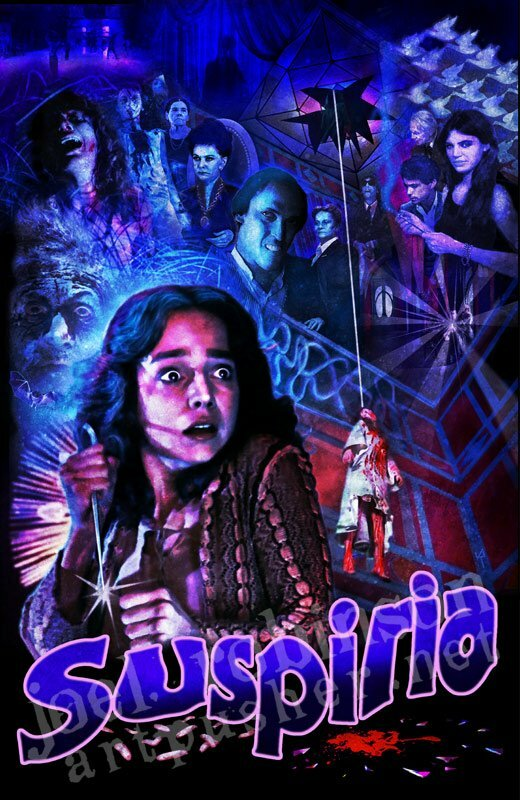
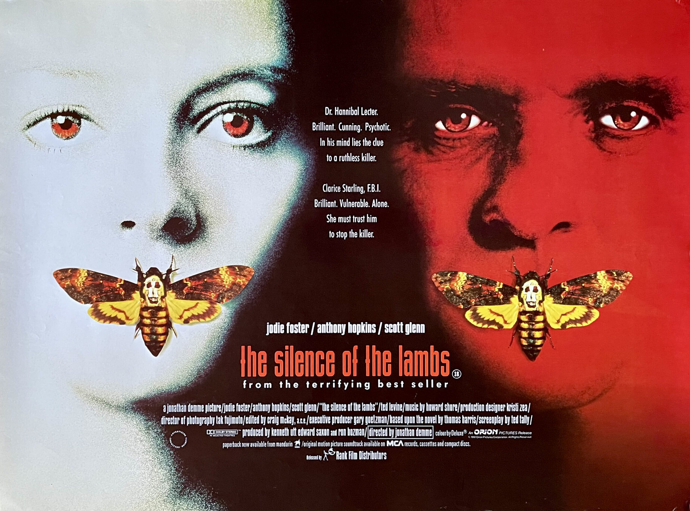

---
output:
  md_document:
    variant: markdown_github
---

<!-- README.md is generated from README.Rmd. Please edit that file -->

```{r, echo = FALSE}
knitr::opts_chunk$set(
  collapse = TRUE,
  comment = "#>",
  fig.path = "figure/"
)
```

# Horror Movie Insprired Palettes


## Installation

```r
install.packages("horroR")
```

__Or the development version__

```r
devtools::install_github("jacobjameson/horroR")
```

## Usage

```{r, palettes_dummy}
library("horroR")
names(horroR_palettes)
```

## Palettes

### Suspiria (1977)


{width=300}

```{r, Suspiria}
horroR_palette("Suspiria")
```

### Midsommar (2019)

{width=300}


```{r, Midsommar}
horroR_palette("Midsommar")
```

### The Neon Demono (2016)


{width=300}


```{r, TheNeonDemon}
horroR_palette("TheNeonDemon")
```


{width=300}


```{r, TheNeonDemon}
horroR_palette("silenceofthelambs")
```


```{r, ggplot1, fig.height = 3}
library("ggplot2")
ggplot(mtcars, aes(factor(cyl), fill=factor(vs))) +  geom_bar() +
  scale_fill_manual(values = horroR_palette("TheNeonDemon"))
```


```{r, volcano, fig.height = 5}
pal <- horroR_palette("Suspiria", 21, type = "continuous")
image(volcano, col = pal)
```

```{r, fig.width = 10.67, fig.height = 4, out.width = 800, out.height = 300, dpi = 150}
library("gridExtra")
library("scales")
data("diamonds")

p1 <- ggplot(
  subset(diamonds, carat >= 2.2),
  aes(x = table, y = price, colour = cut)
) +
  geom_point(alpha = 0.7) +
  geom_smooth(method = "loess", alpha = 0.09, size = 1, span = 1) +
  theme_bw()

p2 <- ggplot(
  subset(diamonds, carat > 2.2 & depth > 55 & depth < 70),
  aes(x = depth, fill = cut)
) +
  geom_histogram(colour = "black", binwidth = 1, position = "dodge") +
  theme_bw()

p1_npg <- p1 + scale_color_manual(values = horroR_palette("Midsommar"))
p2_npg <- p2 + scale_fill_manual(values = horroR_palette("Midsommar"))

grid.arrange(p1_npg, p2_npg, ncol = 2)
```
