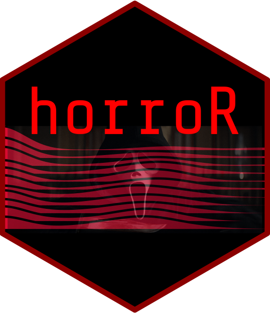

---
output:
  md_document:
    variant: markdown_github
---

<!-- README.md is generated from README.Rmd. Please edit that file -->

```{r, echo = FALSE}
knitr::opts_chunk$set(
  collapse = TRUE,
  comment = "#>",
  fig.path = "figure/",
  warning = FALSE,
  message = FALSE,
  dpi = 150
)
set.seed(666)  # For reproducibility... and the vibes
```


{width=600}


# horroR: Horror Movie Color Palettes and Themes for R

Create atmospheric, creepy data visualizations with color palettes inspired by horror movies, custom ggplot2 themes, and special effects.

## Features

- **30+ Horror Movie Palettes**: Suspiria, The Shining, Get Out, Hereditary, and more
- **10 Mood-Based Palettes**: blood, ghostly, demonic, neonslasher, etc.
- **9 ggplot2 Themes**: theme_horror, theme_slasher, theme_supernatural, and more
- **Special Effects**: Blood drips, fog, scratches, glitch effects, and more
- **Easy-to-use Scale Functions**: scale_fill_horror(), scale_color_horror()

## Installation

```r
install.packages("horroR")
```

__Or the development version__

```r
devtools::install_github("jacobjameson/horroR")
```

## Quick Start

```{r, quick-start}
library("horroR")
library("ggplot2")

# See all available palettes
list_palettes()
```

---

## Palettes

### Horror Movie Palettes

```{r, show-movies, fig.height=8, fig.width=10}
# View movie palettes
show_palettes(c("Suspiria", "TheShining", "GetOut", "Hereditary",
                "Midsommar", "TheNeonDemon", "Halloween", "Scream",
                "Alien", "TheThing", "Jaws", "Carrie"))
```

### Mood-Based Palettes

```{r, show-moods, fig.height=6, fig.width=10}
# View mood palettes
show_palettes(c("blood", "ghostly", "demonic", "neonslasher",
                "forestwitch", "vintage", "occult", "nightmare"))
```

### Individual Palette Previews

```{r, individual-palettes, fig.height=2}
horroR_palette("Suspiria")
horroR_palette("TheShining")
horroR_palette("GetOut")
horroR_palette("blood")
```

---

## Themes Gallery

horroR includes 9 creepy ggplot2 themes. Here's a comparison:

```{r, theme-gallery, fig.height=12, fig.width=12}
library(gridExtra)

# Base plot
base_plot <- function() {
  ggplot(mtcars, aes(x = wt, y = mpg, color = factor(cyl))) +
    geom_point(size = 3) +
    labs(x = "Weight", y = "MPG", color = "Cylinders")
}

# Create themed versions
p1 <- base_plot() + theme_horror() + scale_color_horror("blood") +
  ggtitle("theme_horror()")
p2 <- base_plot() + theme_slasher() + scale_color_horror("Carrie") +
  ggtitle("theme_slasher()")
p3 <- base_plot() + theme_supernatural() + scale_color_horror("ghostly") +
  ggtitle("theme_supernatural()")
p4 <- base_plot() + theme_vintage() + scale_color_horror("vintage") +
  ggtitle("theme_vintage()")
p5 <- base_plot() + theme_neon() + scale_color_horror("neonslasher") +
  ggtitle("theme_neon()")
p6 <- base_plot() + theme_asylum() + scale_color_horror("asylum") +
  ggtitle("theme_asylum()")
p7 <- base_plot() + theme_occult() + scale_color_horror("occult") +
  ggtitle("theme_occult()")
p8 <- base_plot() + theme_witch() + scale_color_horror("forestwitch") +
  ggtitle("theme_witch()")
p9 <- base_plot() + theme_void_horror() + scale_color_horror("nightmare") +
  ggtitle("theme_void_horror()")

grid.arrange(p1, p2, p3, p4, p5, p6, p7, p8, p9, ncol = 3)
```

---

## Real-World Examples

### Time Series: The Horror of Climate Data

```{r, time-series, fig.height=5, fig.width=10}
# Simulated temperature anomaly data
years <- 1900:2024
temp_anomaly <- cumsum(rnorm(length(years), 0.01, 0.1))

climate_data <- data.frame(
  year = years,
  anomaly = temp_anomaly
)

ggplot(climate_data, aes(x = year, y = anomaly)) +
  geom_area(fill = "#8b0000", alpha = 0.3) +
  geom_line(color = "#ff0000", linewidth = 1) +
  geom_hline(yintercept = 0, color = "#666666", linetype = "dashed") +
  labs(
    title = "The Rising Dread",
    subtitle = "Temperature anomalies over time",
    x = "Year",
    y = "Temperature Anomaly"
  ) +
  theme_horror()
```

### Survival Analysis: Who Lives, Who Dies

```{r, survival-plot, fig.height=5, fig.width=9}
# Horror movie survival data (simulated)
survival_data <- data.frame(
  character_type = rep(c("Final Girl", "Jock", "Cheerleader", "Nerd", "Comic Relief"), each = 20),
  survival_time = c(
    runif(20, 80, 100),   # Final Girl - high survival
    runif(20, 20, 50),    # Jock - dies mid-movie
    runif(20, 10, 40),    # Cheerleader - dies early-mid
    runif(20, 50, 80),    # Nerd - survives longer
    runif(20, 30, 60)     # Comic Relief - variable
  )
)

ggplot(survival_data, aes(x = reorder(character_type, survival_time, FUN = median),
                          y = survival_time, fill = character_type)) +
  geom_boxplot(alpha = 0.8) +
  coord_flip() +
  labs(
    title = "Horror Movie Survival by Character Type",
    subtitle = "Some tropes are deadlier than others...",
    x = NULL,
    y = "Minutes Survived"
  ) +
  scale_fill_horror("Scream") +
  theme_slasher() +
  theme(legend.position = "none")
```

### Correlation Heatmap: The Interconnected Nightmare

```{r, correlation-heatmap, fig.height=6, fig.width=8}
# Create correlation matrix
cor_matrix <- cor(mtcars[, 1:7])
cor_df <- as.data.frame(as.table(cor_matrix))
names(cor_df) <- c("Var1", "Var2", "Correlation")

ggplot(cor_df, aes(x = Var1, y = Var2, fill = Correlation)) +
  geom_tile(color = "#1a1a1a") +
  geom_text(aes(label = round(Correlation, 2)), color = "white", size = 3) +
  scale_fill_horror_c("demonic") +
  labs(
    title = "The Correlation Matrix",
    subtitle = "Everything is connected..."
  ) +
  theme_occult() +
  theme(axis.text.x = element_text(angle = 45, hjust = 1))
```

### Distribution Plot: Layers of Terror

```{r, ridgeline-style, fig.height=5, fig.width=9}
# Stacked density plot
ggplot(iris, aes(x = Sepal.Length, fill = Species)) +
  geom_density(alpha = 0.7, color = "#1a1a1a") +
  labs(
    title = "Layers of the Unknown",
    subtitle = "What lurks beneath the surface?",
    x = "Measurement",
    y = "Density"
  ) +
  scale_fill_horror("Suspiria") +
  theme_supernatural()
```

---

## Before & After: Transform Your Plots

### Default ggplot2
```{r, before-plot, fig.height=4, fig.width=8}
ggplot(diamonds[sample(nrow(diamonds), 1000), ],
       aes(x = carat, y = price, color = cut)) +
  geom_point(alpha = 0.6) +
  labs(title = "Diamond Prices", subtitle = "Default theme")
```

### With horroR
```{r, after-plot, fig.height=4, fig.width=8}
ggplot(diamonds[sample(nrow(diamonds), 1000), ],
       aes(x = carat, y = price, color = cut)) +
  geom_point(alpha = 0.6) +
  labs(title = "Diamond Prices", subtitle = "Now with added dread...") +
  scale_color_horror("TheNeonDemon") +
  theme_neon()
```

---

## Scale Functions

### Discrete Scales

```{r, discrete-examples, fig.height=4, fig.width=10}
p1 <- ggplot(mpg, aes(x = class, fill = class)) +
  geom_bar() +
  scale_fill_horror("Halloween") +
  theme_horror() +
  theme(axis.text.x = element_text(angle = 45, hjust = 1)) +
  labs(title = "Halloween Palette")

p2 <- ggplot(mpg, aes(x = class, fill = class)) +
  geom_bar() +
  scale_fill_horror("Jaws") +
  theme_horror() +
  theme(axis.text.x = element_text(angle = 45, hjust = 1)) +
  labs(title = "Jaws Palette")

grid.arrange(p1, p2, ncol = 2)
```

### Continuous Scales

```{r, continuous-examples, fig.height=4, fig.width=10}
p1 <- ggplot(faithfuld, aes(waiting, eruptions, fill = density)) +
  geom_raster() +
  scale_fill_horror_c("blood") +
  theme_horror() +
  labs(title = "Blood Palette")

p2 <- ggplot(faithfuld, aes(waiting, eruptions, fill = density)) +
  geom_raster() +
  scale_fill_horror_c("ghostly") +
  theme_supernatural() +
  labs(title = "Ghostly Palette")

grid.arrange(p1, p2, ncol = 2)
```

### Reversed Palettes

```{r, reversed-palette, fig.height=4, fig.width=8}
ggplot(faithfuld, aes(waiting, eruptions, fill = density)) +
  geom_raster() +
  scale_fill_horror_c("blood", reverse = TRUE) +
  theme_horror() +
  labs(title = "Reversed Blood Palette",
       subtitle = "Use reverse = TRUE to flip the palette")
```

---

## Special Effects

### Adding Atmosphere

```{r, effects-demo, fig.height=5, fig.width=8}
# Base plot with horror theme
ggplot(mtcars, aes(x = wt, y = mpg)) +
  geom_point(color = "#8b0000", size = 4, alpha = 0.8) +
  geom_smooth(method = "lm", color = "#ff0000", fill = "#3d0000", alpha = 0.3) +
  labs(
    title = "They're Coming...",
    subtitle = spooky_message(),
    x = "Weight (1000 lbs)",
    y = "Miles per Gallon"
  ) +
  theme_horror()
```

### Available Effects

```{r, list-effects}
list_effects()
```

### Spooky Messages for Your Plots

```{r, spooky-messages}
# Add random creepy messages to your plots
spooky_message()
spooky_message()
spooky_message()
spooky_message()
```

---
## Utility Functions

### Get Individual Colors

```{r, get-colors}
# Extract specific colors from palettes
horror_color("blood", 1)  # Darkest blood
horror_color("blood", 4)  # Medium blood
horror_color("blood", 8)  # Brightest blood

# Get colors from movie palettes
horror_color("Suspiria", 2)  # Purple from Suspiria
horror_color("TheShining", 1) # Red from The Shining
```

### Creepify Any Color

```{r, creepify-demo}
# Transform cheerful colors into creepy ones
original <- c("#00ff00", "#ff69b4", "#00bfff", "#ffff00")
creepy <- sapply(original, creepify_color)

# Show the transformation
data.frame(
  Original = original,
  Creepy = creepy
)
```

```{r, creepify-visual, fig.height=3, fig.width=8}
# Visual comparison
colors_df <- data.frame(
  type = rep(c("Original", "Creepified"), each = 4),
  color_num = rep(1:4, 2),
  color = c("#00ff00", "#ff69b4", "#00bfff", "#ffff00",
            creepify_color("#00ff00"), creepify_color("#ff69b4"),
            creepify_color("#00bfff"), creepify_color("#ffff00"))
)

ggplot(colors_df, aes(x = color_num, y = type, fill = color)) +
  geom_tile(color = "black", linewidth = 1) +
  scale_fill_identity() +
  labs(title = "Color Transformation: Before & After Creepification") +
  theme_horror() +
  theme(axis.title = element_blank(),
        axis.text.x = element_blank(),
        axis.ticks = element_blank())
```

---

## Classic Visualizations

### Volcano with Suspiria

```{r, volcano, fig.height = 5, fig.width=8}
pal <- horroR_palette("Suspiria", 100, type = "continuous")
image(volcano, col = pal, main = "Volcano - Suspiria Palette",
      xlab = "", ylab = "", axes = FALSE)
```

### Volcano with Different Palettes

```{r, volcano-comparison, fig.height = 8, fig.width=10}
par(mfrow = c(2, 2), mar = c(1, 1, 3, 1))

image(volcano, col = horroR_palette("blood", 100, type = "continuous"),
      main = "blood", axes = FALSE)
image(volcano, col = horroR_palette("TheRing", 100, type = "continuous"),
      main = "TheRing", axes = FALSE)
image(volcano, col = horroR_palette("Alien", 100, type = "continuous"),
      main = "Alien", axes = FALSE)
image(volcano, col = horroR_palette("demonic", 100, type = "continuous"),
      main = "demonic", axes = FALSE)

par(mfrow = c(1, 1))
```

---

## Movie-Inspired Showcase

### The Shining: All Work and No Play

```{r, shining-showcase, fig.height=5, fig.width=9}
# Simulated "work" data
work_data <- data.frame(
  day = rep(1:30, 5),
  worker = rep(LETTERS[1:5], each = 30),
  pages_typed = c(
    rep(1, 30),  # Worker A: just types "All work and no play"
    cumsum(rpois(30, 3)),
    cumsum(rpois(30, 5)),
    cumsum(rpois(30, 2)),
    cumsum(rpois(30, 4))
  )
)

ggplot(work_data, aes(x = day, y = pages_typed, color = worker)) +
  geom_line(linewidth = 1.2) +
  geom_point(size = 2) +
  labs(
    title = "All Work and No Play...",
    subtitle = "Daily writing productivity at the Overlook Hotel",
    x = "Day",
    y = "Cumulative Pages",
    color = "Writer"
  ) +
  scale_color_horror("TheShining") +
  theme_vintage()
```

### Get Out: The Sunken Place

```{r, getout-showcase, fig.height=5, fig.width=8}
# Spiral into the sunken place
t <- seq(0, 20, length.out = 1000)
spiral <- data.frame(
  x = t * cos(t),
  y = t * sin(t),
  depth = t
)

ggplot(spiral, aes(x = x, y = y, color = depth)) +
  geom_path(linewidth = 1.5) +
  scale_color_horror_c("GetOut") +
  labs(title = "The Sunken Place", subtitle = "Sink into the void...") +
  theme_void_horror() +
  theme(legend.position = "none",
        plot.title = element_text(color = "#d4af37", hjust = 0.5),
        plot.subtitle = element_text(color = "#666666", hjust = 0.5)) +
  coord_fixed()
```

### Alien: In Space, No One Can Hear You Scream

```{r, alien-showcase, fig.height=5, fig.width=9}
# Simulated radar/sonar data
n_points <- 500
radar_data <- data.frame(
  angle = runif(n_points, 0, 2*pi),
  distance = rexp(n_points, 0.5),
  signal = runif(n_points)
)

ggplot(radar_data, aes(x = angle, y = distance, color = signal)) +
  geom_point(alpha = 0.7, size = 2) +
  scale_color_horror_c("Alien") +
  coord_polar() +
  labs(
    title = "Motion Tracker",
    subtitle = "They're coming out of the walls..."
  ) +
  theme_void_horror() +
  theme(
    plot.title = element_text(color = "#8abaca", hjust = 0.5),
    plot.subtitle = element_text(color = "#5a7a8a", hjust = 0.5),
    legend.position = "none"
  )
```

---

## All Available Palettes

### Movie Palettes (30)
Suspiria, Coraline, Scream, NightmareOnElmStreet, TheShining, TheNeonDemon,
Midsommar, Silenceofthelambs, TheExorcist, GetOut, Hereditary, TheWitch,
ItFollows, Halloween, TheRing, Us, AQuietPlace, Carrie, Psycho,
TheTexasChainsawMassacre, Alien, TheThing, Jaws, Poltergeist, TheOmen,
Rosemary, Blair, Conjuring, Insidious, Sinister

### Mood Palettes (10)
blood, ghostly, demonic, forestwitch, neonslasher, vintage, asylum, occult,
nightmare, decay

---

## Themes Reference

| Theme | Description | Best Paired With |
|-------|-------------|------------------|
| `theme_horror()` | Dark base theme with blood-red accents | blood, Carrie, TheOmen |
| `theme_slasher()` | High contrast 80s slasher style | Halloween, Scream, NightmareOnElmStreet |
| `theme_supernatural()` | Ethereal, ghostly appearance | ghostly, TheRing, Poltergeist |
| `theme_vintage()` | Old film sepia tones | vintage, Psycho, Rosemary |
| `theme_neon()` | Vibrant neon-noir horror | neonslasher, TheNeonDemon, Suspiria |
| `theme_asylum()` | Cold, clinical psychological horror | asylum, GetOut, Insidious |
| `theme_occult()` | Dark purple and gold | occult, Hereditary, TheOmen |
| `theme_witch()` | Forest greens and earthy browns | forestwitch, TheWitch, Blair |
| `theme_void_horror()` | Minimalist cosmic horror | nightmare, Alien, TheThing |

---

## Contributing

Found a bug or want to add a palette from your favorite horror movie?
Open an issue or PR at https://github.com/jacobjameson/horroR

*"In space, no one can hear you plot..."*
