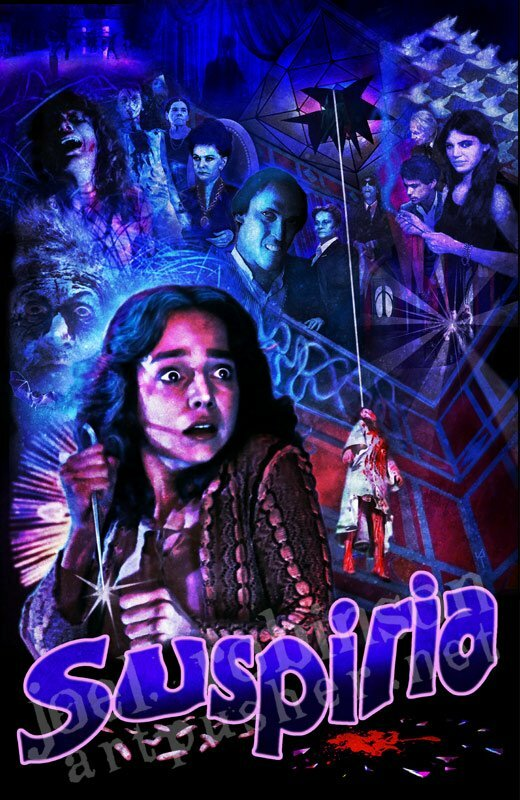

---
output:
  md_document:
    variant: markdown_github
---

<!-- README.md is generated from README.Rmd. Please edit that file -->

```{r, echo = FALSE}
knitr::opts_chunk$set(
  collapse = TRUE,
  comment = "#>",
  fig.path = "figure/",
  warning = FALSE,
  message = FALSE
)
```


{width=600}


# horroR: Horror Movie Color Palettes and Themes for R

Create atmospheric, creepy data visualizations with color palettes inspired by horror movies, custom ggplot2 themes, and special effects.

## Features

- **30+ Horror Movie Palettes**: Suspiria, The Shining, Get Out, Hereditary, and more
- **10 Mood-Based Palettes**: blood, ghostly, demonic, neonslasher, etc.
- **9 ggplot2 Themes**: theme_horror, theme_slasher, theme_supernatural, and more
- **Special Effects**: Blood drips, fog, scratches, glitch effects, and more
- **Easy-to-use Scale Functions**: scale_fill_horror(), scale_color_horror()

## Installation

```r
install.packages("horroR")
```

__Or the development version__

```r
devtools::install_github("jacobjameson/horroR")
```

## Quick Start

```{r, quick-start}
library("horroR")
library("ggplot2")

# See all available palettes
list_palettes()
```

## Palettes

### Horror Movie Palettes

```{r, show-movies, fig.height=8}
# View movie palettes
show_palettes(c("Suspiria", "TheShining", "GetOut", "Hereditary",
                "Midsommar", "TheNeonDemon", "Halloween", "Scream"))
```

### Mood-Based Palettes

```{r, show-moods, fig.height=6}
# View mood palettes
show_palettes(c("blood", "ghostly", "demonic", "neonslasher",
                "forestwitch", "vintage"))
```

### Individual Palette Preview

#### Suspiria (1977)

{width=300}

```{r, Suspiria}
horroR_palette("Suspiria")
```

#### The Shining (1980)

```{r, TheShining}
horroR_palette("TheShining")
```

#### Get Out (2017)

```{r, GetOut}
horroR_palette("GetOut")
```

#### Hereditary (2018)

```{r, Hereditary}
horroR_palette("Hereditary")
```

## Themes

horroR includes 9 creepy ggplot2 themes:

```{r, list-themes}
list_themes()
```

### Theme Examples

```{r, theme-horror, fig.height=4}
ggplot(mtcars, aes(x = wt, y = mpg, color = factor(cyl))) +
  geom_point(size = 3) +
  labs(title = "The Horror Theme", subtitle = "Dark and bloody") +
  scale_color_horror("blood") +
  theme_horror()
```

```{r, theme-slasher, fig.height=4}
ggplot(mtcars, aes(x = factor(cyl), fill = factor(cyl))) +
  geom_bar() +
  labs(title = "The Slasher Theme", subtitle = "80s slasher vibes") +
  scale_fill_horror("Carrie") +
  theme_slasher()
```

```{r, theme-supernatural, fig.height=4}
ggplot(mtcars, aes(x = wt, y = mpg, color = factor(gear))) +
  geom_point(size = 3) +
  labs(title = "Supernatural Theme", subtitle = "Ethereal and ghostly") +
  scale_color_horror("ghostly") +
  theme_supernatural()
```

```{r, theme-neon, fig.height=4}
ggplot(diamonds[sample(nrow(diamonds), 1000), ], aes(x = carat, y = price, color = cut)) +
  geom_point(alpha = 0.7) +
  labs(title = "Neon Demon Theme", subtitle = "Neon-noir horror") +
  scale_color_horror("TheNeonDemon") +
  theme_neon()
```

```{r, theme-occult, fig.height=4}
ggplot(mtcars, aes(x = factor(cyl), fill = factor(vs))) +
  geom_bar(position = "dodge") +
  labs(title = "Occult Theme", subtitle = "Dark rituals and gold") +
  scale_fill_horror("occult") +
  theme_occult()
```

```{r, theme-witch, fig.height=4}
ggplot(mtcars, aes(x = wt, y = mpg)) +
  geom_point(size = 3, color = "#4a5a4a") +
  geom_smooth(method = "lm", color = "#6a8a5a", fill = "#3a4a3a") +
  labs(title = "Forest Witch Theme", subtitle = "Folk horror in the woods") +
  theme_witch()
```

## Scale Functions

Easy integration with ggplot2:

```{r, scales-discrete, fig.height=4}
# Discrete scales
ggplot(mtcars, aes(x = factor(cyl), fill = factor(cyl))) +
  geom_bar() +
  scale_fill_horror("Suspiria") +
  theme_horror()
```

```{r, scales-continuous, fig.height=4}
# Continuous scales
ggplot(faithfuld, aes(waiting, eruptions, fill = density)) +
  geom_tile() +
  scale_fill_horror_c("blood") +
  theme_horror() +
  labs(title = "Continuous Horror Scale")
```

## Special Effects

Add creepy effects to your plots:

```{r, effects-example, fig.height=5}
# Blood drips and fog
p <- ggplot(mtcars, aes(x = wt, y = mpg)) +
  geom_point(color = "#8b0000", size = 3) +
  labs(title = "Something is watching...") +
  theme_horror()

# Note: Effects work best when viewed in a graphics device
p
```

### Available Effects

```{r, list-effects}
list_effects()
```

### Spooky Messages

```{r, spooky}
# Get random creepy messages for your plots
spooky_message()
spooky_message()
spooky_message()
```

## Utility Functions

```{r, utilities}
# Get a specific color from a palette
horror_color("blood", 4)

# Make any color creepier
creepify_color("#00ff00")  # Creepy green
creepify_color("pink", darkness = 0.5)
```

## Full Gallery

### Continuous Palette Example

```{r, volcano, fig.height = 5}
pal <- horroR_palette("Suspiria", 21, type = "continuous")
image(volcano, col = pal)
```

### Diamond Analysis with Horror Themes

```{r, diamonds-horror, fig.height = 4}
ggplot(
  data = subset(diamonds, cut != 'Fair'),
  aes(x = price, group = cut, fill = cut)
) +
  geom_density(adjust = 1.5, position = "fill") +
  scale_fill_horror("TheShining") +
  theme_vintage() +
  labs(title = "Diamond Prices by Cut", subtitle = "A vintage horror perspective")
```

### Heatmap with Blood Palette

```{r, heatmap-blood, fig.height = 5}
ggplot(faithfuld, aes(waiting, eruptions, fill = density)) +
  geom_raster() +
  scale_fill_horror_c("demonic") +
  theme_occult() +
  labs(title = "Old Faithful Eruptions", subtitle = "The ritual continues...")
```

## All Available Palettes

### Movie Palettes
Suspiria, Coraline, Scream, NightmareOnElmStreet, TheShining, TheNeonDemon,
Midsommar, Silenceofthelambs, TheExorcist, GetOut, Hereditary, TheWitch,
ItFollows, Halloween, TheRing, Us, AQuietPlace, Carrie, Psycho,
TheTexasChainsawMassacre, Alien, TheThing, Jaws, Poltergeist, TheOmen,
Rosemary, Blair, Conjuring, Insidious, Sinister

### Mood Palettes
blood, ghostly, demonic, forestwitch, neonslasher, vintage, asylum, occult,
nightmare, decay

## Contributing

Found a bug or want to add a palette from your favorite horror movie?
Open an issue or PR at https://github.com/jacobjameson/horroR
