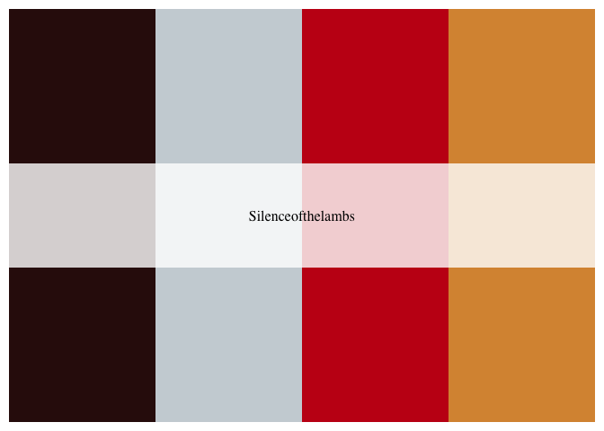
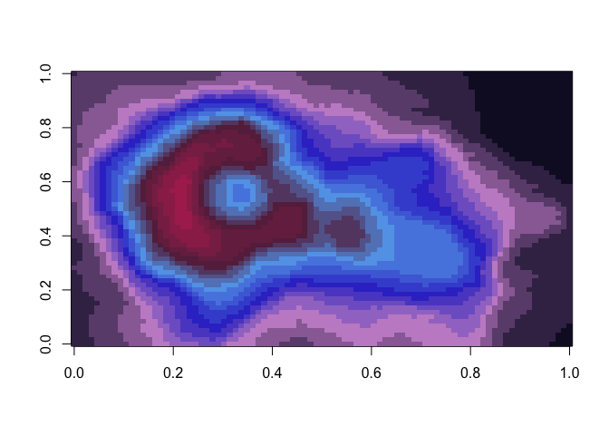
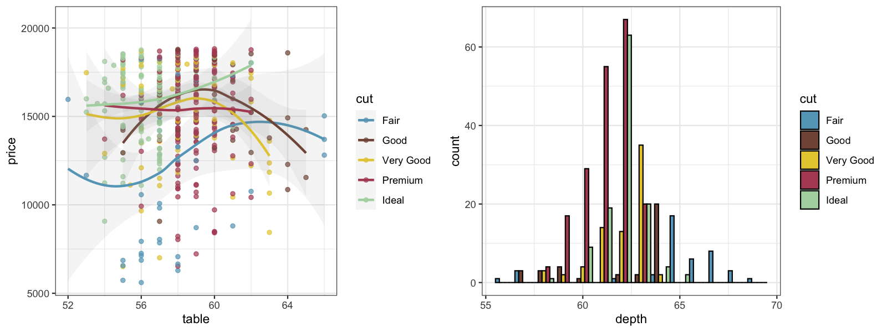
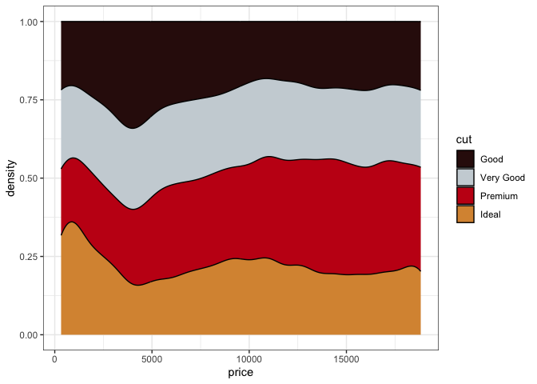

<!-- README.md is generated from README.Rmd. Please edit that file -->


# Horror Movie Insprired Palettes

## Installation

``` r
install.packages("horroR")
```

**Or the development version**

``` r
devtools::install_github("jacobjameson/horroR")
```

## Usage

``` r
library("horroR")
names(horroR_palettes)
#> [1] "Suspiria"             "Coraline"             "Scream"              
#> [4] "NightmareOnElmStreet" "TheShining"           "TheNeonDemon"        
#> [7] "Midsommar"            "Silenceofthelambs"
```

## Palettes

### Suspiria (1977)


``` r
horroR_palette("Suspiria")
```


### Midsommar (2019)


``` r
horroR_palette("Midsommar")
```


### The Neon Demono (2016)


``` r
horroR_palette("TheNeonDemon")
```


``` r
horroR_palette("Silenceofthelambs")
```



``` r
library("ggplot2")
ggplot(mtcars, aes(factor(cyl), fill=factor(vs))) +  geom_bar() +
  scale_fill_manual(values = horroR_palette("TheNeonDemon"))
```


``` r
pal <- horroR_palette("Suspiria", 21, type = "continuous")
image(volcano, col = pal)
```



``` r
library("gridExtra")
library("scales")
data("diamonds")

p1 <- ggplot(
  subset(diamonds, carat >= 2.2),
  aes(x = table, y = price, colour = cut)
) +
  geom_point(alpha = 0.7) +
  geom_smooth(method = "loess", alpha = 0.09, size = 1, span = 1) +
  theme_bw()
#> Warning: Using `size` aesthetic for lines was deprecated in ggplot2 3.4.0.
#> ℹ Please use `linewidth` instead.

p2 <- ggplot(
  subset(diamonds, carat > 2.2 & depth > 55 & depth < 70),
  aes(x = depth, fill = cut)
) +
  geom_histogram(colour = "black", binwidth = 1, position = "dodge") +
  theme_bw()

p1_npg <- p1 + scale_color_manual(values = horroR_palette("Midsommar"))
p2_npg <- p2 + scale_fill_manual(values = horroR_palette("Midsommar"))

grid.arrange(p1_npg, p2_npg, ncol = 2)
#> `geom_smooth()` using formula = 'y ~ x'
```



``` r
p <- ggplot(
  data=subset(diamonds, cut != 'Fair'), 
  aes(x=price, group=cut, fill=cut)) +
    geom_density(adjust=1.5, position="fill") +
  theme_bw()

p + scale_fill_manual(values = horroR_palette("Silenceofthelambs"))
```


