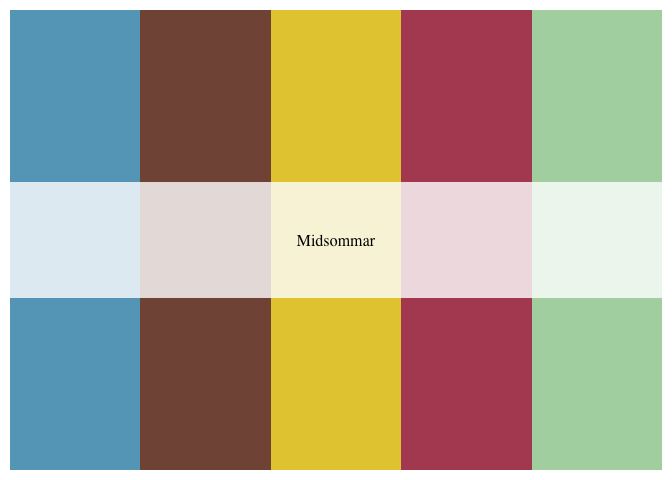

<!-- README.md is generated from README.Rmd. Please edit that file -->

# Horror Movie Insprired Palettes

## Installation

``` r
install.packages("horroR")
```

**Or the development version**

``` r
devtools::install_github("jacobjameson/horroR")
```

## Usage

``` r
library("horroR")
names(horroR_palettes)
#> [1] "Suspiria"             "Coraline"             "Scream"              
#> [4] "NightmareOnElmStreet" "TheShining"           "TheNeonDemon"        
#> [7] "Midsommar"
```

## Palettes

### Suspiriam (2018)

``` r
horroR_palette("Suspiria")
```


### Midsommar (2019)

``` r
horroR_palette("Midsommar")
```



### The Neon Demono (2016)

``` r
horroR_palette("TheNeonDemon")
```


``` r
library("ggplot2")
ggplot(mtcars, aes(factor(cyl), fill=factor(vs))) +  geom_bar() +
  scale_fill_manual(values = horroR_palette("TheNeonDemon"))
```


``` r
pal <- horroR_palette("TheNeonDemon", 21, type = "continuous")
image(volcano, col = pal)
```


``` r
pal <- horroR_palette("Midsommar", 100, type = "continuous")
# heatmap is a local dataset
ggplot(heatmap, aes(x = X2, y = X1, fill = value)) +
  geom_tile() + 
  scale_fill_gradientn(colours = pal) + 
  scale_x_discrete(expand = c(0, 0)) +
  scale_y_discrete(expand = c(0, 0)) + 
  coord_equal() 
```


